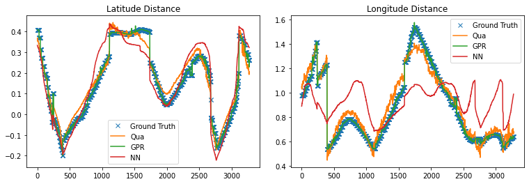
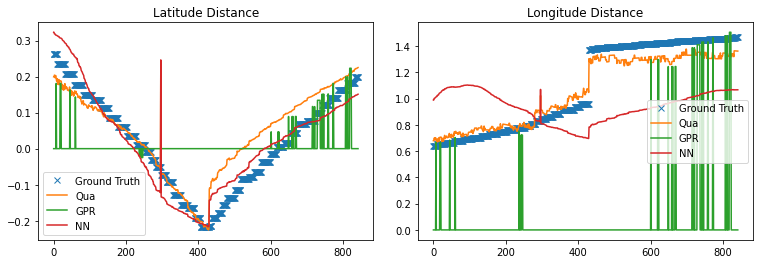

## Compare-Regression-methods-for-Coordinator-Transformation-Learning

### Background
- Given camera with unknown parameter, it is impossible to use traditional camera calibration to connstruct coordinator transoformation matrix.
- Single camera source, tradictional depth estimation methods depending on multiple sources of imaging cannot work. 
    
### Goal
Learn coordinator transformation function between image coordinator and world coordinator.
### Motivation 
We observed underlying quadratic relationship between nomallized image coordinates and nomallized GPS distance between camera and object.
### Methods
we will compare below methods:
- Gaussian Process Regression (**GPR**)
- Kernel Regression with Quadratic Kernel (**Qua**)
- Neural Network (**NN**)

### Results
- comparison on training dataset:<br>

- comparison on testing dataset: <br>


### Liscence

This research is one part of **Smooth Georeferenced Tracking from a Moving Uncalibrated Monocular Camera**. If you use below codes, please cite

```
@proceeding{Bolu2021smooth,
  author={},
  title= "{Smooth Georeferenced Tracking from a MovingUncalibrated Monocular Camera}",
  series = {Thirty-fifth Conference on Neural Information Processing Systems},
  volume={},
  number={},
  pages={},
  year={2021},
  publisher={NeurIPS}}
```
All rights reserved by FAMU-FSU Autonomous System Group (ASG). 

This research is a part of the 2nd place entry for the US Navy’s AI Tracks at Sea 2020 challenge.The current version of the software is open source at https://github.com/fsudssAI/AI-track-at-sea.

Any questions, please contact Yu Zheng(yz19b@fsu.edu), Dr. Olugbenga Anubi(oanubi@fsu.edu).
